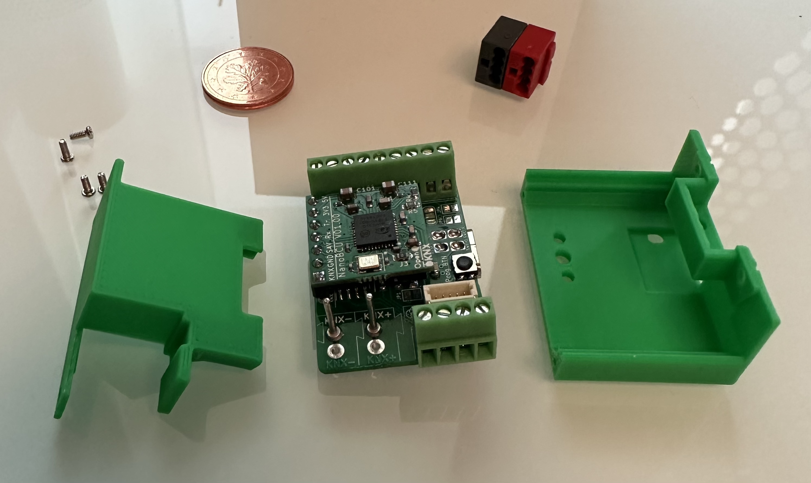
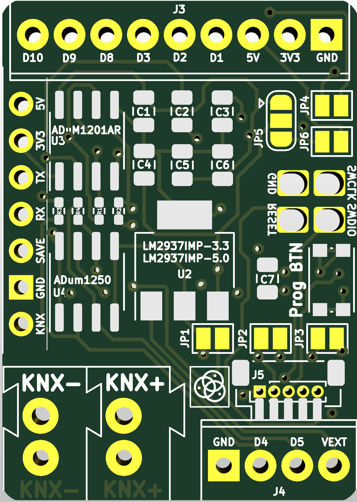
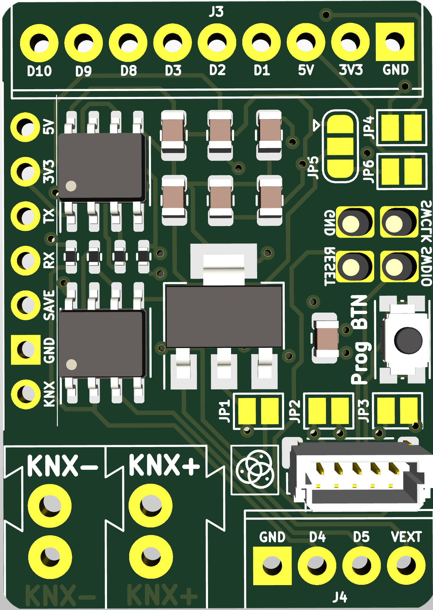
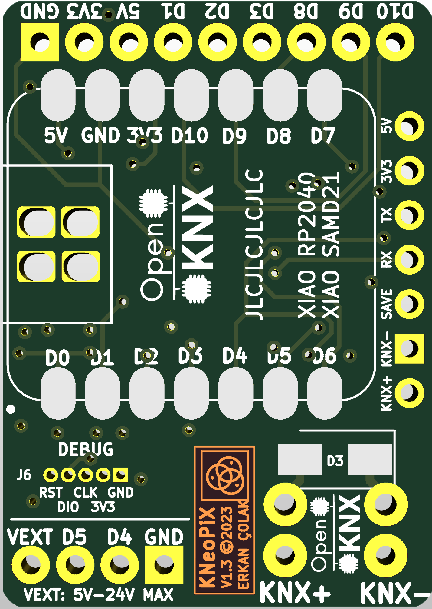
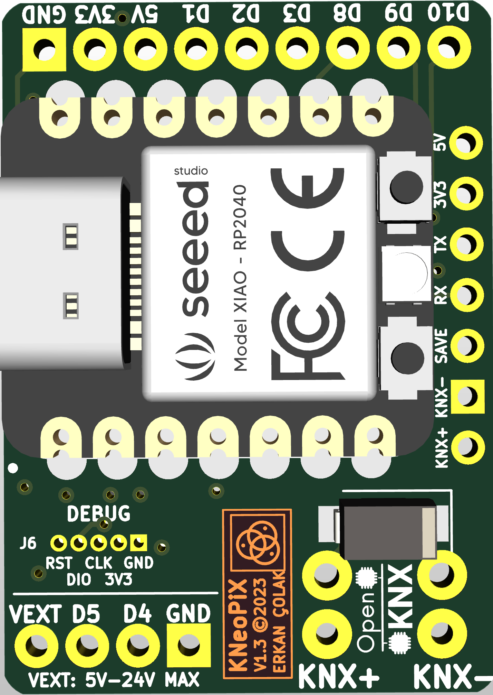
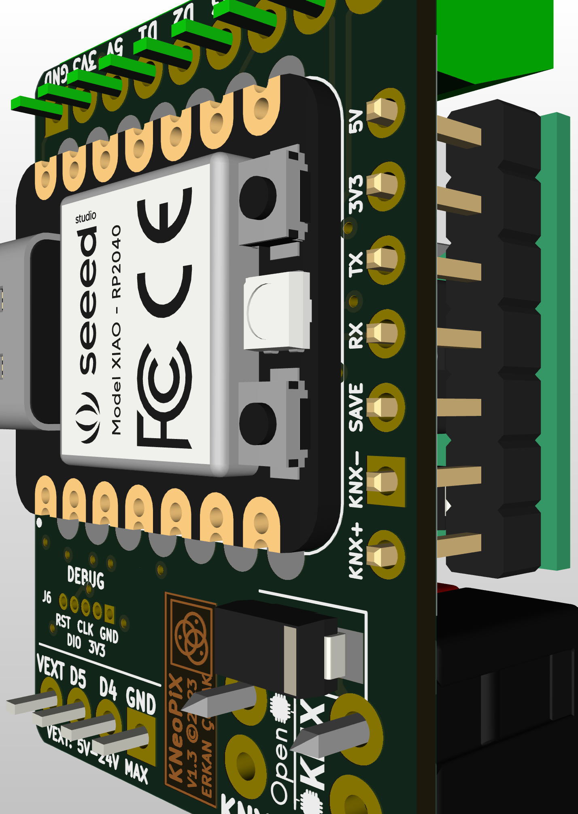
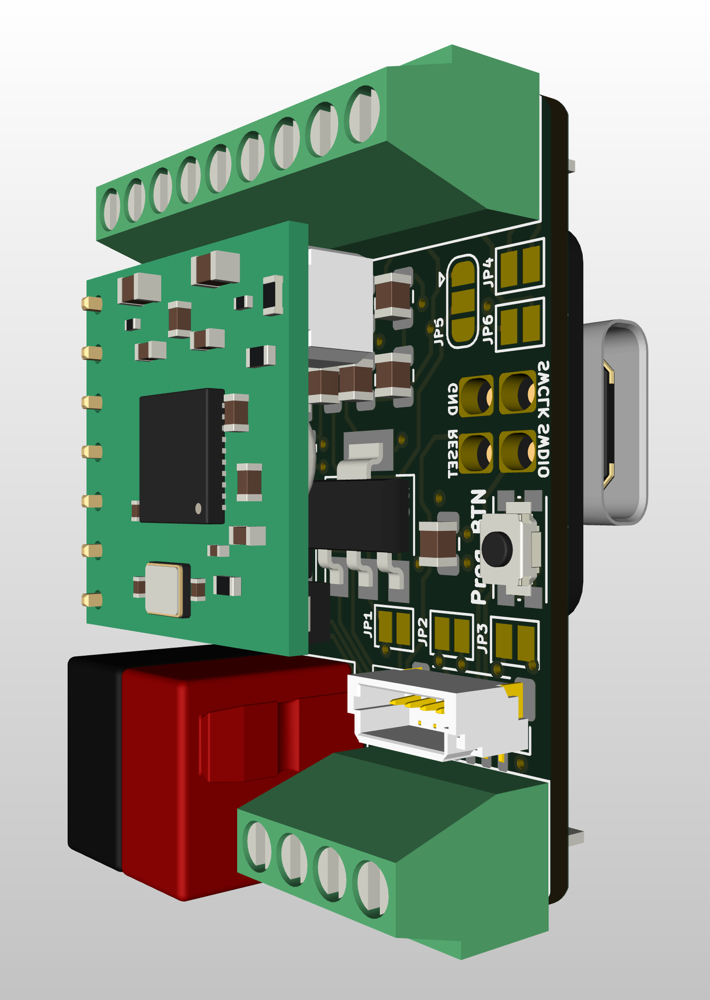
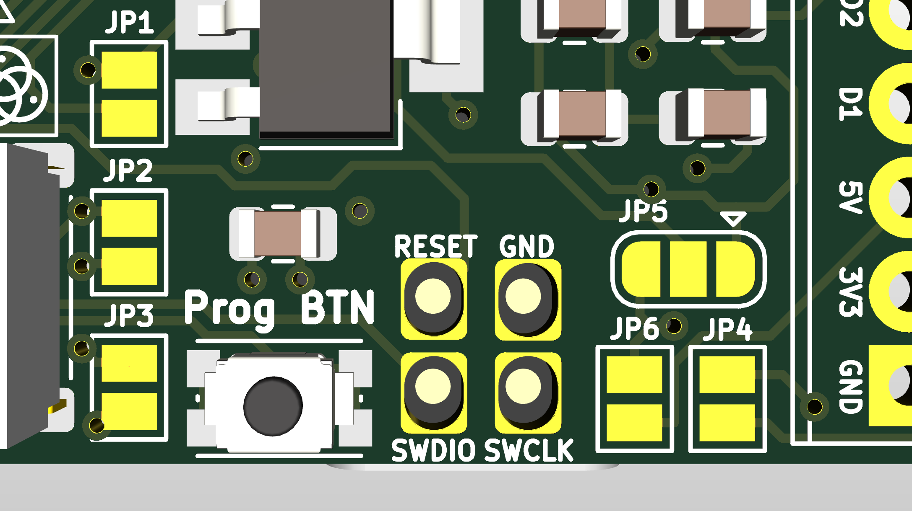
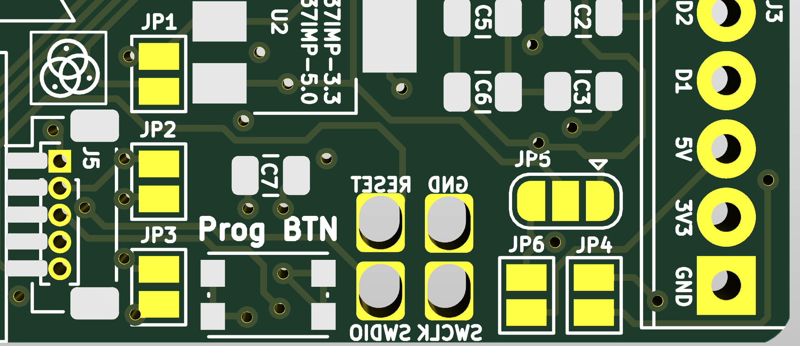
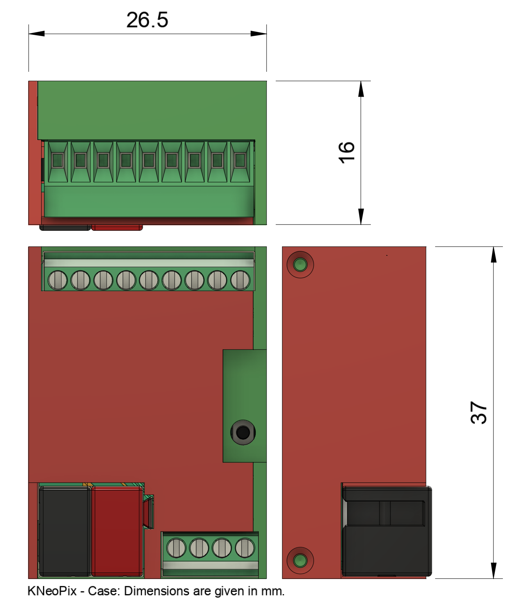

# OpenKNX - KNeoPix

## Preliminary Information about OpenKNX KNeoPix

The **OpenKNX KNeoPix** is a hardware solution designed specifically for DIY (Do It Yourself) projects in the realm of building automation and intelligent networking. Created for enthusiasts and hobbyists, it allows users to develop creative KNX automation solutions. **KNeoPix** is a DIY product and does not come with any warranties. This means that users are responsible for assembly, configuration, and operation. **KNeoPix** is fully compatible with the **openKNX** software platform, ensuring seamless integration within the **OpenKNX** ecosystem.

Additionally, **KNeoPix** supports LED control, including **WS2815**, **SM16704**, and **SK6812** addressable LEDs, with voltage ranges from **3.3V to 24V**. Two isolated IOs are dedicated for this LED control, allowing for smooth management of lighting systems. Moreover, **6 direct IOs** are available for additional control purposes, making **KNeoPix** a versatile solution for various applications in building automation.

### Hardware

The hardware of **KNeoPix** is based on either the [XIAO RP2040](https://www.seeedstudio.com/XIAO-RP2040-v1-0-p-5026.html) or the [XIAO SAMD21](https://www.seeedstudio.com/Seeeduino-XIAO-Arduino-Microcontroller-SAMD21-Cortex-M0+-p-4426.html) microcontroller. It works in conjunction with the [OpenKNX BCU](https://github.com/OpenKNX/OpenKNX/wiki/NanoBCU) platform, enabling a broad range of applications in building KNX automation and smart home networking.

### Power Supply

A standout feature of **KNeoPix** is its flexible power supply options. It can be powered directly from the **KNX bus voltage** at either **3.3V** or **5V**, facilitating straightforward integration into KNX-based systems. Additionally, it can be powered via an external voltage source ranging from **6V to 24V**. This flexibility allows **KNeoPix** to accommodate a wide variety of installation scenarios and adapt to diverse system requirements.

### Galvanic Isolation

When powered by an external voltage source, **KNeoPix** offers **galvanic isolation** from the KNX bus. This feature ensures a safe and reliable integration into KNX networks by protecting against electrical disturbances, enhancing overall system stability.

### Inputs and Outputs (I/Os)

**KNeoPix** provides a total of **6 direct** and **2 isolated** inputs and outputs (I/Os), offering versatile application possibilities. Its primary function is to control **RGB LEDs** via the two isolated I/Os, enabling captivating lighting effects for smart buildings. The six direct I/Os can be used for additional control tasks, making **KNeoPix** an incredibly flexible tool for various building automation purposes.

### Voltage Options

**KNeoPix** supports multiple voltage configurations, operating both the external voltage at **3.3V/5V** as a direct power supply, or using **6V to 24V** as a variable power supply. This provides maximum flexibility in configuring and deploying the hardware to meet specific project requirements.

### Pin Compatibility

Another key feature of **KNeoPix** is its **pin compatibility** with other microcontrollers in the **XIAO series**, such as the [XIAO ESP32C3](https://www.seeedstudio.com/Seeed-XIAO-ESP32C3-p-5431.html) and [XIAO ESP32S3](https://www.seeedstudio.com/XIAO-ESP32S3-p-5627.html). This compatibility enhances its versatility, allowing users to take advantage of existing hardware for their projects and easily integrate with other XIAO boards.

## KNeoPiX Documentation

This documentation provides details about the KNeoPiX board and its components, including jumper settings, connections, power source options, and other related information.

### Available IOs and Descriptions i.e. for XIAO RP2040 and SAMD21

|  **IO Number**  | **``XIAO RP2040 Pins``** | **``SAMD21 Pins``** | **Description**                   |
| :-------------------: | :------------------------------------------------------------------------------------------------------------------------------- | :----------------------------------------------------------------------------------------------------------------------------------- | :-------------------------------------- |
|         D0**         | GPIO0 / A0                                                                                                                       | GPIO0 / A0                                                                                                                           | **Non-isolated IO - Prog Button** |
|     **D1**     | GPIO1 / A1                                                                                                                       | GPIO1 / A1                                                                                                                           | **Non-isolated IO**               |
|     **D2**     | GPIO2 / A2                                                                                                                       | GPIO2 / A2                                                                                                                           | **Non-isolated IO**               |
|     **D3**     | GPIO3 / A3                                                                                                                       | GPIO3 / A3                                                                                                                           | **Non-isolated IO**               |
|     **D4**     | GPIO4 / SDA                                                                                                                      | GPIO4 / SDA                                                                                                                          | **Isolated IO - NEO DATA0 OUT**   |
|     **D5**     | GPIO5 / SCL                                                                                                                      | GPIO5 / SCL                                                                                                                          | **Isolated IO - NEO DATA1 OUT**   |
|     **D6**     | GPIO6 / TX                                                                                                                       | GPIO6 / TX                                                                                                                           | **Isolated IO - to KNX RX**       |
|     **D7**     | GPIO7 / RX                                                                                                                       | GPIO7 / RX                                                                                                                           | **Isolated IO - to KNX TX**       |
|     **D8**     | GPIO8 / SCK                                                                                                                      | GPIO8 / SCK                                                                                                                          | **Non-isolated IO**               |
|     **D9**     | GPIO9 / MISO                                                                                                                     | GPIO9 / MISO                                                                                                                         | **Non-isolated IO**               |
|     **D10**     | GPI010 / MOSI                                                                                                                    | GPI010 / MOSI                                                                                                                        | **Non-isolated IO**               |
| **OnBoard LED** | GPIO25 / RGB BLUE                                                                                                                | GPIO19 / BLUE                                                                                                                        | **USER LED**                      |
| **OnBoard LED** | GPIO16 / RGB GREEN                                                                                                               | GPIO18 / BLUE                                                                                                                        | **USER LED**                      |
| **OnBoard LED** | GPIO17 / RGB RED                                                                                                                 | GPIO17 / YELLOW                                                                                                                      | **USER LED**                      |
|       NEOPIXEL       | GPIO12 / RGB NEOPIXEL                                                                                                            | N/A                                                                                                                                  | **Onboard NEOPIXEL RGB LED**      |
|     **SWD**     | SWDIO, SWCLK, RST                                                                                                                | SWDIO, SWCLK, RST                                                                                                                    | **Debugging Interface**           |
| **Prog Button** | GPIO26 (RUN)                                                                                                                     | PA15 (RUN)                                                                                                                           | **Program Button Interface**      |

### Material

KNeoPix PCB can be Ordered from the [OpenKNX-Community](https://github.com/OpenKNX/OpenKNX/wiki/Device-Overview) or you can manufacture (i.e.: [jlcpcb.com](https://jlcpcb.com/) ) your own PCB using the BOM/CPL and GERBER from [Release Folder](Hardware/Release/v1.3/)

The [Schematic](/Documentation/Schematic_v1.3.pdf) provides all related and also additional Informations!

### Soldering

The final soldering targets (Designators) are all documented on the PCB. You must align the board with solder pads from XIAO to ensure that the board is properly aligned with XIAO.
It is best to use the markings provided for this purpose and the solder pap holes, which can then be seen on the top of the circuit board. It is best to use an adhesive strip to fix the circuit board and XIAO in place.

- Soldering sequence: Start with the smallest components (SMD Capacitors, ICs, passivce throuch-hole, connectors, transsistors, ...)
  Here the Soldering Example, from left to right.
  
  -      
  - To solder the debug interface connections, you should solder the designated holes. Be careful not to create any solder bridges between RESET, GND, SWDIO, and SWCLK. These connections are optional.
    
    
- Finish by soldering larger components ( screw terminals).
- Check all solder joints for proper connections and make sure no short circuits are present.

## Jumper Soldering / Power Source Selection Guide

- **R1, R2 and R3, R4**: 0 Ohm. Bridge them if you do not wan't to use the isolators.
- **J4** Screw Terminal block of Isolated I/Os and Voltage IN/OUT
- **J3**: Screw Terminal block for non-isolated I/Os and Volteage OUT
- **SW1**: Programming button (KNX Pro Button) to interact with the microcontroller.
- **Debug** Connection to monitor / Debug the microcontroller.
  **JP1** GND KNX Voltage Selection
- **JP2** **3.3V** KNX Input Voltage.
- **JP5** Select U2 and Input Voltage. Jumper to select voltage source:
  - **Bridge 1+2** for**3V3**.
  - **Bridge 2+3** for**5V**.
- **JP6** **5V** KNX Input Voltage

**External VCC input** allows the board to be powered by an external DC power source (6-24V):

- **JP3**: Select between**3.3V** or**5V** input from external power.
- **U2 (LM2937IMP-3.3/5.0)**: convertd external voltage to either **3.3V** or **5V**.
- **JP5**: Used to select the desired output voltage.
  - **Bridge 1+2** for**3.3V** output.
  - **Bridge 2+3** for**5V** output.

### Jumper Setting Table

**Attention:** You can not combine the use cases. Only **one** use case in the following table is valid.

| **Use Case**                              | **Jumpers to Bridge**           | **Additional Information**                                           |
| ----------------------------------------------- | ------------------------------------- | -------------------------------------------------------------------------- |
| **KNX 3V3 ONLY**                          | JP1 → Bridge JP2 → Bridge           | JP3 → Bridge possible JP5 → Bridge 1+2 (3V3) possible                    |
| **KNX 5V ONLY**                           | JP1 → Bridge JP6 → Bridge           | JP3 → Bridge possible JP5 → Bridge 2+3 (5V) possible                     |
| **External 3V3 ONLY**                     | JP5 → Bridge 1+2 (3V3)               | **Do NOT Bridge:** JP1/JP2/JP3                                       |
| **External 5V ONLY**                      | JP5 → Bridge 2+3 (5V)                | **Do NOT Bridge:** JP1/JP2/JP3                                       |
| **EXTERNAL VCC IN (6–24V)**              | JP5 → Bridge 1+2 (for 3.3V output)   | LM2937IMP–3.3 out is 3V3                                                  |
|                                                 | JP5 → Bridge 2+3 (for 5V output)     | LM2937IMP–5.0 out is 5V                                                   |
| **EXTERNAL VCC IN is 3V3**                | JP3 → Bridge JP2 → Bridge           | Be careful! Selected Voltage must fit the Jumper Settings.                 |
| **EXTERNAL VCC IN is 5V**                 | JP3 → Bridge JP6 → Bridge           |                                                                            |
| **EXTERNAL VCC IN to OUT (Special Case)** | JP3 → Bridge (for 5V or 3V3)         | External VCC will be used as OUT!**ONLY** use **KNX VCC ONLY** |
| **Special Case**                          | JP5 → Bridge for selected EXT_VCC_IN | Use delivered KNX VCC without external power source                        |

**Note:** For **EXTERNAL VCC** input, you need to solder components U2, C3, C4.

- **For External VCC Input**: Ensure that U2, C3, and C4 are soldered.
- **Power Source Selection**: Always double-check the jumper settings before powering the board to avoid damaging components.

---

## Enclosure / Case

The **KNeoPix** enclosure consists of two parts and the are available as **STL files**: [TOP Case](Hardware/CAD-Files/Release/Case-Deckel_rp2040.stl)and [Button Case](Hardware/CAD-Files/Release/Case-Gehäuse_rp2040.stl). You can print it with your own 3D printer or through a service like **JLCPCB**. I recommend using **PETG** material for its durability and heat resistance, but you’re free to choose any material that fits your needs.

The enclosure is designed to fit the fully assembled PCB perfectly. Only **four screws** are needed to secure everything.

**The assembly process is as follows:**

  

1. **Insert the PCB**: Slide the PCB into the case, starting with the**USB-C port** into its dedicated slot.
2. **Attach the cover**: Once the PCB is in place, insert and secure the top cover.
3. **Fit the KNX terminal**: After assembly, the KNX terminal will align perfectly.

The enclosure has two openings:

- One on the**top** for the**Prog button**.
- One on the**bottom**, depending on whether you’re using the**ESP**,**RP2040**, or**SAMD21** version of the**XIAO**, for the**Boot** and**Reset buttons**, as well as the**LEDs**.

